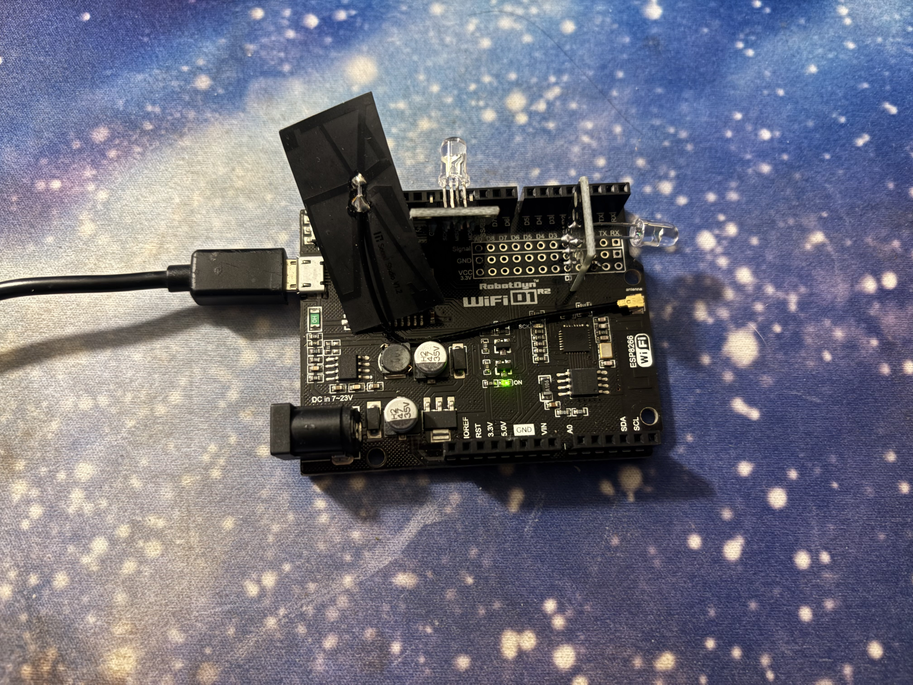

# IR Remote based on ESP8266



This is a simple IR sender using the WIFI enabled ESP8266 module and web server to send RC5 protocol encoded packets, for the philips MC235 Micro HIFI CD Player/Tuner. Using the `https://github.com/crankyoldgit/IRremoteESP8266` library.

To configure WiFi names and passwords, create a `password.hpp` file in the same directory as `IRServer.cpp`

```cpp
const char* SSID_Arr[] = {<ssid_here>};
const char* PASSWORD_Arr[] = {<password here>};

const int NUM_CONN = sizeof(SSID_Arr)/sizeof(SSID_Arr[0]);
```
Like so, this will automatically allow the board to connect to multiple WiFi networks as you configure.